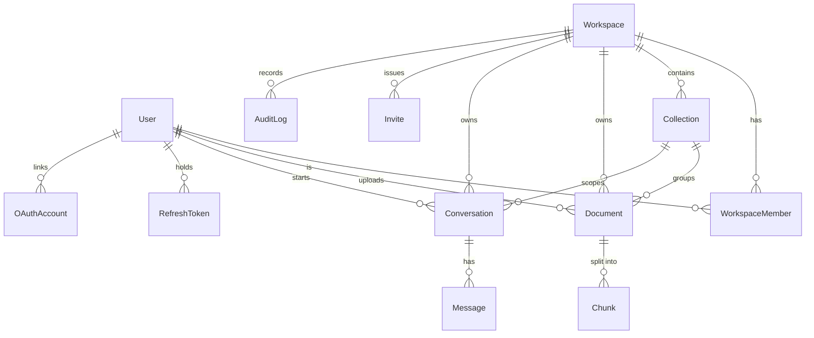

# ContextHub AI — Project Progress & Architecture

> A multi-tenant **RAG (Retrieval-Augmented Generation)** platform.
> Users organize documents into workspaces/collections, the system ingests &
> embeds them, then answers questions with an LLM grounded in those documents.

- **Backend:** NestJS 11 + Prisma 7 (PostgreSQL, `pgvector`)
- **Auth:** JWT access/refresh + Google OAuth + magic link
- **API base path:** `/api/v1` (global prefix)
- **Last updated:** 2026-05-17

---

## 1. Module status at a glance

| # | Module | Status | AI involved? | Depends on |
|---|--------|--------|--------------|------------|
| 1 | **Auth** | ✅ Done | No | — |
| 2 | **Workspace** | ✅ Done | No | Auth |
| 3 | **Collection** | ✅ Done | No | Workspace |
| 4 | **Document + Storage** | ✅ Done | No | Collection, Workspace |
| 5 | **Job + Ingestion pipeline** | ✅ Done | ⚠️ Embeddings (Gemini) | Document, Storage |
| 6 | **Chat (RAG query)** | ✅ Done | ✅ Gemini (Gen AI) | Chunk, Collection |
| 7 | **Audit log** | ⬜ Remaining | No | Workspace (schema exists) |

**Prisma schemas already exist for every model** (workspace, collection,
document, chunk, chat, audit, job, user, auth) — remaining work is the
application code, not the data model.

---

## 2. Data model & relationships



**Key relationships in words**

- A **User** joins one or more **Workspaces** via **WorkspaceMember** (role: `OWNER` / `ADMIN` / `MEMBER`).
- A **Workspace** holds many **Collections**; a **Collection** holds many **Documents**.
- A **Document** is split into ordered **Chunks** (each with a `vector(1536)` embedding for similarity search).
- A **Conversation** belongs to a workspace (optionally scoped to one collection) and has many **Messages** (USER / ASSISTANT, with citations).
- **AuditLog** records actor + action per workspace.
- **Job** is a generic async work queue row (`type`, `status`, `payload`) — drives the ingestion pipeline.

---

## 3. Finished modules — detail

### 3.1 Auth ✅

**What it does:** registration, login, token refresh/rotation, logout, profile,
password change, magic-link login, Google OAuth. A global `JwtAuthGuard`
protects every route; `@Public()` opts specific routes out.

| Method | Route | Public? | Purpose |
|--------|-------|---------|---------|
| POST | `/auth/register` | ✅ | Create account |
| POST | `/auth/login` | ✅ | Email/password login |
| POST | `/auth/refresh` | ✅ (refresh guard) | Rotate tokens |
| POST | `/auth/logout` | 🔒 | Revoke refresh token |
| GET | `/auth/me` | 🔒 | Current profile |
| PATCH | `/auth/me` | 🔒 | Update profile |
| POST | `/auth/change-password` | 🔒 | Change password |
| POST | `/auth/magic-link/request` | ✅ | Email a magic link |
| GET | `/auth/magic-link/verify` | ✅ | Consume magic link |
| GET | `/auth/google` + `/auth/google/callback` | ✅ | Google OAuth flow |

**Process:** passwords hashed (bcrypt); refresh tokens stored hashed in
`RefreshToken`; magic links / verification via hashed `VerificationToken`.

---

### 3.2 Workspace ✅

**What it does:** workspace CRUD, membership, role-based access, email invites.
`WorkspaceGuard` checks the caller's membership for the workspace in the route
param and enforces `@Roles(...)`; it attaches `request.membership`.

| Method | Route | Min role | Purpose |
|--------|-------|----------|---------|
| POST | `/workspaces` | any user | Create (caller becomes OWNER) |
| GET | `/workspaces` | any user | List my workspaces |
| GET | `/workspaces/:id` | member | Get one |
| PATCH | `/workspaces/:id` | OWNER | Update |
| DELETE | `/workspaces/:id` | OWNER | Delete |
| GET | `/workspaces/:id/members` | member | List members |
| POST | `/workspaces/:id/invite` | OWNER/ADMIN | Email an invite |
| POST | `/workspaces/invites/accept` | any user | Accept invite by token |
| PATCH | `/workspaces/:id/members/:userId` | OWNER | Change member role |
| DELETE | `/workspaces/:id/members/:userId` | OWNER/ADMIN | Remove member |
| POST | `/workspaces/:id/leave` | member | Leave workspace |

**Process:** unique slug generation; invites are hashed tokens emailed via
`MailService`, with a TTL; "last owner" protection prevents orphaned workspaces.

---

### 3.3 Collection ✅

**What it does:** CRUD for collections (document folders) inside a workspace.
Nested under the workspace route so it **reuses `WorkspaceGuard`** for free.

| Method | Route | Min role |
|--------|-------|----------|
| POST | `/workspaces/:id/collections` | member |
| GET | `/workspaces/:id/collections` | member |
| GET | `/workspaces/:id/collections/:collectionId` | member |
| PATCH | `/workspaces/:id/collections/:collectionId` | OWNER/ADMIN |
| DELETE | `/workspaces/:id/collections/:collectionId` | OWNER/ADMIN |

**Process:** every read/write runs through `getOwnedOrThrow` — a collection ID
from another workspace returns **404**, not the record (tenant isolation).
List/get include `_count` of documents & conversations.

---

### 3.4 Document + Storage ✅

**What it does:** file upload, listing, metadata, download (stream), delete.
A separate `@Global()` **StorageService** abstracts the bytes (local FS now,
swappable to S3 later) — callers only ever touch the opaque `storageKey`.

| Method | Route | Min role | Purpose |
|--------|-------|----------|---------|
| POST | `.../collections/:collectionId/documents` | member | Upload (multipart `file`) |
| GET | `.../collections/:collectionId/documents?status=` | member | List (optional status filter) |
| GET | `.../documents/:documentId` | member | Metadata |
| GET | `.../documents/:documentId/download` | member | Stream the file |
| DELETE | `.../documents/:documentId` | OWNER/ADMIN | Delete row + stored file |

**Process / validation:**
- Collection ownership verified by reusing `CollectionService.getById`.
- MIME allowlist: pdf, txt, md, html, csv, json, doc, docx.
- Size cap: `MAX_UPLOAD_MB` (default 25).
- Storage path is traversal-guarded; key shape: `workspaces/<wsId>/<uuid>-<name>`.
- New document is created with `status = UPLOADED` → **this is the entry point of the ingestion pipeline**.

`DocStatus` lifecycle: `UPLOADED → PARSING → CHUNKING → EMBEDDING → READY` (or `FAILED`).

---

### 3.5 Chat / RAG ✅

**What it does:** conversations + the retrieval-augmented question/answer loop.
Nested under the workspace route so it **reuses `WorkspaceGuard`**. Conversations
are private to the user that started them (scoped by `workspaceId + userId`).

| Method | Route | Purpose |
|--------|-------|---------|
| POST | `/workspaces/:id/conversations` | Create a conversation (optional `collectionId` to scope retrieval) |
| GET | `/workspaces/:id/conversations` | List my conversations (pinned first) |
| GET | `/workspaces/:id/conversations/:cId` | Get one + full message history |
| GET | `/workspaces/:id/conversations/:cId/messages` | List messages |
| POST | `/workspaces/:id/conversations/:cId/messages` | **Ask a question** — runs RAG, returns the cited answer |
| PATCH | `/workspaces/:id/conversations/:cId` | Rename / pin |
| DELETE | `/workspaces/:id/conversations/:cId` | Delete |

**The `ask` pipeline** (`ChatService`): persist USER message → `RetrievalService`
embeds the question (`EmbeddingService`) and runs a pgvector nearest-neighbour
search (`embedding <=> $query`, scoped to the workspace/collection) → assemble a
prompt (system rules + last-10 turns + numbered context passages) → `LlmService`
calls **Gemini** (`gemini-2.5-flash`) → persist ASSISTANT message with
`citations` JSON (source chunk/document/snippet/score). If no chunks exist, it
returns a grounded "no documents" answer without calling the LLM.

**Files:** [chat.controller.ts](contexthub-backend/src/chat/chat.controller.ts),
[chat.service.ts](contexthub-backend/src/chat/chat.service.ts),
[retrieval.service.ts](contexthub-backend/src/chat/retrieval.service.ts),
[conversation.service.ts](contexthub-backend/src/chat/conversation.service.ts),
[llm.service.ts](contexthub-backend/src/chat/llm.service.ts).

**Provider note:** generation uses **Gemini**, not Claude — both embedding and
chat go through one provider/SDK (`@google/genai`). `LlmService` is the only file
that touches the chat provider, so swapping it later is a one-file change.

---

## 4. End-to-end flow

### Working today (no AI yet)

```
Register/Login ──► Create Workspace ──► Create Collection
      │                                        │
      ▼                                        ▼
  JWT tokens                          Upload Document(s)
                                      status = UPLOADED
                                      bytes saved via StorageService
```

### Intended full RAG flow (after remaining modules)

```
Upload Document (UPLOADED)
        │  enqueue Job{type:"ingest"}
        ▼
[Ingestion pipeline]  PARSING → CHUNKING → EMBEDDING → READY
   parse text → split into Chunks → embed each chunk → store vector(1536)
        │
        ▼
User asks a question in a Conversation
        │  embed the question
        ▼
Vector similarity search over Chunks (pgvector)
        │  top-K relevant chunks
        ▼
Build prompt (question + retrieved chunks) ──► Gemini ──► Answer + citations
        │
        ▼
Persist USER + ASSISTANT Messages (citations = source chunks)
```

---

## 5. Remaining work (roadmap)

| Order | Module | What to build | AI |
|-------|--------|---------------|----|
| ~~1~~ | ~~Job + Ingestion~~ | ✅ Done — see [contexthub-backend/MODULE-5-INGESTION.md](contexthub-backend/MODULE-5-INGESTION.md) | ⚠️ Embedding model |
| ~~2~~ | ~~Chat / RAG~~ | ✅ Done — `Conversation`/`Message` CRUD; embed query; pgvector search; prompt assembly; **Gemini** call; persist messages + citations | ✅ Gemini (Gen AI) |
| 1 | **Audit log** | Write `AuditLog` entries on key actions (invite, role change, doc delete, etc.); list endpoint | No |
| 2 | Hardening | Rate limiting, pagination, OpenAPI/Swagger, e2e tests, fix Jest/Prisma-ESM | No |

---

## 6. Known issues / notes

- **Jest specs fail on a pre-existing Prisma-ESM resolver issue** (the generated
  client uses `.js` ESM imports Jest's resolver can't follow). This affects
  *all* spec files including the original `workspace` one. `nest build` /
  `tsc --noEmit` are the reliable gates and are green. Fix later via Jest
  `moduleNameMapper` for `generated/prisma`.
- **`@types/multer` not installed** (offline npm registry — cert error). A
  minimal local `UploadedFileLike` type is used instead; runtime is unaffected.
- **`pgvector`** is required in Postgres for the `Chunk.embedding`
  `vector(1536)` column (Prisma `Unsupported(...)`). Ensure the extension is
  enabled before the ingestion module ships.
- Local uploads are written under `/storage` (git-ignored). Configure with
  `STORAGE_DIR`; swap `StorageService` for an S3 implementation in production.

---

## 7. Configuration (env vars)

| Var | Default | Used by |
|-----|---------|---------|
| `PORT` | `3000` | server |
| `WEB_URL` | `http://localhost:3001` | OAuth redirect |
| `INVITE_TTL_DAYS` | `7` | Workspace invites |
| `STORAGE_DIR` | `./storage` | StorageService |
| `MAX_UPLOAD_MB` | `25` | Document upload limit |
| `DATABASE_URL` | — | Prisma datasource |
| `GEMINI_API_KEY` | — | Embeddings + chat (Gemini) |
| `EMBEDDING_MODEL` | `gemini-embedding-001` | Ingestion embeddings |
| `EMBEDDING_DIM` / `EMBEDDING_BATCH_SIZE` | `1536` / `100` | Ingestion embeddings |
| `CHAT_MODEL` | `gemini-2.5-flash` | RAG answer generation |
| `CHAT_TEMPERATURE` | `0.2` | RAG generation sampling |
| `CHAT_MAX_OUTPUT_TOKENS` | `1024` | RAG answer length cap |
| `RAG_TOP_K` | `5` | Chunks retrieved per question |
| JWT / Google / SMTP secrets | — | Auth (see `.env`) |
