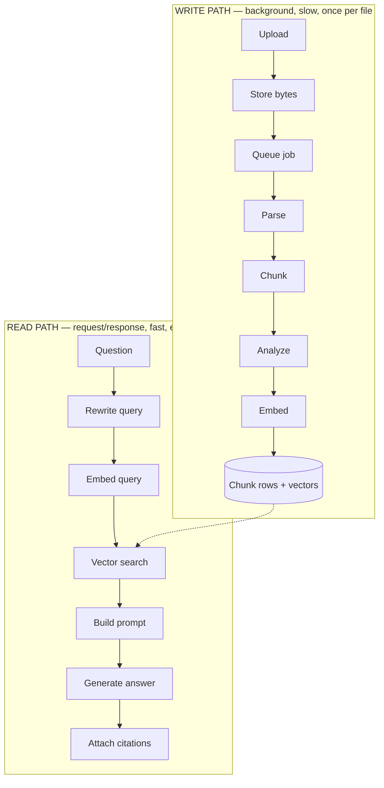
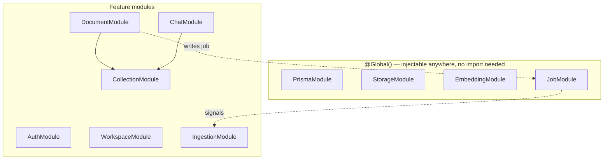
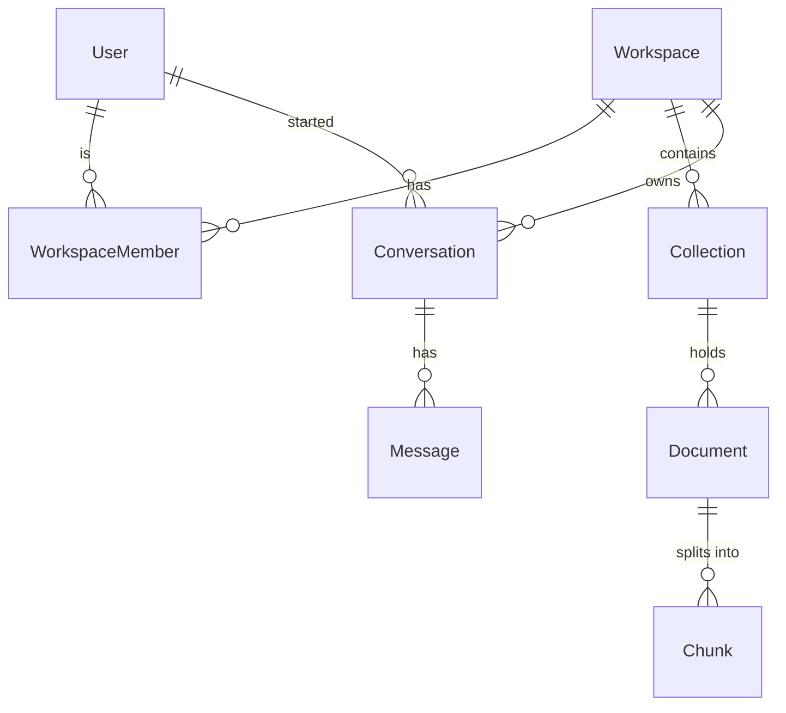
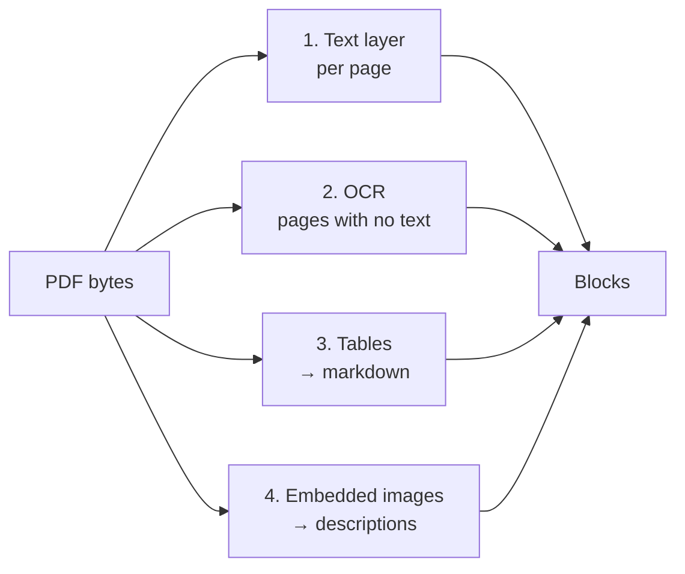
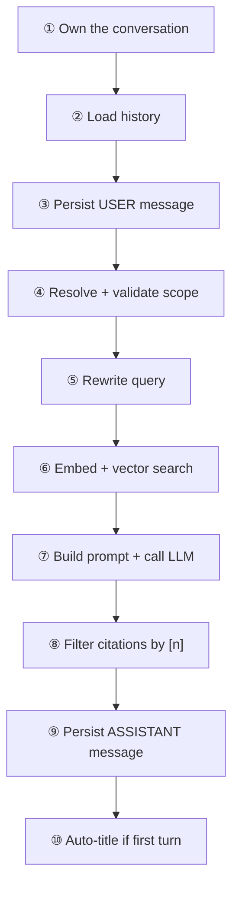

# ContextHub AI — RAG System, End to End

> **Audience:** a backend developer (NestJS / Prisma) who is comfortable with APIs
> and databases but new to AI. Every AI step below is described as what it
> actually is — an HTTP call, a SQL query, or a data transform.
>
> **Scope:** the complete source-grounded RAG chat system — how a file becomes
> searchable, and how a question becomes a cited answer.
>
> **Last updated:** 2026-08-29

---

## Table of contents

1. [What the system does](#1-what-the-system-does)
2. [The two pipelines](#2-the-two-pipelines)
3. [Module map](#3-module-map)
4. [Data model](#4-data-model)
5. [Write path — ingestion](#5-write-path--ingestion)
6. [Read path — query](#6-read-path--query)
7. [Multimodal support](#7-multimodal-support)
8. [Document intelligence](#8-document-intelligence)
9. [Security and tenant isolation](#9-security-and-tenant-isolation)
10. [API reference](#10-api-reference)
11. [Configuration](#11-configuration)
12. [Failure handling](#12-failure-handling)
13. [Performance notes](#13-performance-notes)
14. [Known limits and next steps](#14-known-limits-and-next-steps)
15. [Glossary](#15-glossary)

---

## 1. What the system does

A team uploads documents into a **workspace**. The system reads each file —
including tables, charts and scanned pages — and turns everything into
searchable text. Users then ask questions in a chat, and get answers **grounded
in their own documents**, with clickable citations back to the exact passage.

The core promise is that an answer about your documents can always be traced to
a source. The system is built so it either cites a real passage or says it could
not find one — it should never invent a fact about your files.

**Stack**

| Layer | Choice |
|---|---|
| API | NestJS 11, global prefix `/api/v1` |
| Database | PostgreSQL + `pgvector` extension |
| ORM | Prisma 7 (client generated to `generated/prisma`) |
| Chat / vision / analysis model | `gemini-2.5-flash` |
| Embedding model | `gemini-embedding-001`, 1536 dimensions |
| File storage | local filesystem (swappable — see [StorageService](#storage)) |
| Queue | PostgreSQL table + `FOR UPDATE SKIP LOCKED` (no Redis) |
| Frontend | Next.js 16, React 19 |

### The one idea behind RAG

A language model does not know your documents. So instead of *training* it, you
**retrieve** the few passages most likely to contain the answer and paste them
into the prompt. That is the whole trick:

```
question → find relevant passages → put them in the prompt → model answers from them
```

"Retrieval-Augmented Generation" is literally: generation, augmented by
retrieval.

---

## 2. The two pipelines

Everything in the system is one of two flows.



| | Write path | Read path |
|---|---|---|
| Trigger | a file upload | a chat message |
| Mode | background job | HTTP request/response |
| Duration | seconds to minutes | 2–5 seconds |
| Model calls | 1 per scanned page + 1 per image + 1 analysis + embeddings | 2 on the first question, 3 on follow-ups |
| Failure | retried 3×, then `FAILED` | HTTP 500 to the caller |

They meet at exactly one place: the `Chunk` table. The write path fills it, the
read path searches it. Nothing else is shared, which is why
`DocumentModule` never imports `IngestionModule` and there is no circular
dependency anywhere in the codebase.

---

## 3. Module map

Ten NestJS modules, registered in `app.module.ts`.



| Module | Responsibility |
|---|---|
| `PrismaModule` | database client (`@Global`) |
| `StorageModule` | file bytes on disk (`@Global`) |
| `EmbeddingModule` | text → vectors (`@Global`) |
| `JobModule` | durable background queue (`@Global`) |
| `AuthModule` | JWT + refresh tokens + Google OAuth; registers the **global** `JwtAuthGuard` |
| `WorkspaceModule` | workspaces, members, invites, roles |
| `CollectionModule` | collections (folders) inside a workspace |
| `DocumentModule` | upload, list, download, delete, reprocess; chunk images |
| `IngestionModule` | parse → chunk → analyze → embed |
| `ChatModule` | conversations, query rewriting, retrieval, answering |

### Cross-cutting pieces

| Piece | Where | What it does |
|---|---|---|
| `JwtAuthGuard` | `APP_GUARD` in `AuthModule` | every route needs a valid JWT unless marked `@Public()` |
| `WorkspaceGuard` | `@UseGuards` per controller | caller must be a member of `:id`; enforces `@Roles(...)` |
| `ValidationPipe` | `main.ts` | DTO validation, `whitelist`, `forbidNonWhitelisted`, `transform` |
| `AllExceptionsFilter` | `APP_FILTER` in `AppModule` | one JSON error shape for every failure |
| `LoggingInterceptor` | `APP_INTERCEPTOR` in `AppModule` | one access-log line per request, stamps `X-Request-Id` |

There is **no middleware** in the system — cross-cutting behaviour is guards,
pipes, interceptors and filters only.

---

## 4. Data model



### The three tables that matter for RAG

**`Document`** — one uploaded file.

| Column | Notes |
|---|---|
| `status` | `UPLOADED → PARSING → CHUNKING → ANALYZING → EMBEDDING → READY`, or `FAILED` |
| `errorMessage` | why it failed, truncated to 1000 chars |
| `storageKey` | opaque key, `workspaces/{wsId}/{uuid}-{name}` |
| `summary` | generated abstract (see [document intelligence](#8-document-intelligence)) |
| `docType` | closed enum: `REPORT`, `CONTRACT`, `PLAN`, … 13 values |
| `topics` | `String[]`, lowercase keywords |
| `analyzedAt` | when the above three were written |

**`Chunk`** — one searchable passage.

| Column | Notes |
|---|---|
| `content` | the passage text, **verbatim** |
| `ordinal` | position across the whole document, preserves reading order |
| `kind` | `TEXT` \| `TABLE` \| `IMAGE` \| `OCR` — where the text came from |
| `pageNumber` | source page, when known |
| `imageKey` | storage key of the source chart — `IMAGE` chunks only |
| `embedding` | `vector(1536)`, declared `Unsupported(...)` in Prisma |

**`Message`** — one chat turn.

| Column | Notes |
|---|---|
| `role` | `USER` \| `ASSISTANT` |
| `content` | the text |
| `citations` | `Json?` — array of `Citation` objects, assistant messages only |

### Why raw SQL appears in two places

Prisma cannot read or write a `vector` column — it is declared
`Unsupported("vector(1536)")`. So exactly two files use `$executeRaw` /
`$queryRaw`:

- `IngestionService.replaceChunks()` — writes vectors
- `RetrievalService.retrieve()` — reads them by similarity

Both build a parameterized `'[0.1,0.2,…]'::vector` literal. Everywhere else in
the codebase uses normal Prisma queries.

---

## 5. Write path — ingestion

### 5.1 Upload (synchronous, ~50ms)

`POST /workspaces/:id/collections/:collectionId/documents`

```
JwtAuthGuard → WorkspaceGuard → FileInterceptor → DocumentService.create()
```

`create()` does six things and returns immediately:

1. verify the collection belongs to this workspace (404 otherwise)
2. validate MIME type against a whitelist, and size against `MAX_UPLOAD_MB`
3. `storage.save()` — bytes to disk
4. `prisma.document.create()` with `status: UPLOADED`
5. `jobs.enqueue('ingest', { documentId })`
6. `signal.notify()` — ring the worker's doorbell

The response is a `201` with `status: "UPLOADED"`. **No AI work has happened
yet.** The frontend polls `GET .../documents` and watches `status` advance.

**Accepted types:** `pdf`, `docx`, `txt`, `md`, `html`, `csv`, `json`, and the
images `png`, `jpeg`, `webp`, `gif`. Legacy `.doc` is explicitly rejected with a
message telling the user to re-save as `.docx`.

### 5.2 The job queue

There is no Redis and no BullMQ. Work lives in a `Job` table, and the claim is a
single atomic statement:

```sql
UPDATE "Job"
   SET status = 'RUNNING', attempts = attempts + 1, "updatedAt" = now()
 WHERE id = (
   SELECT id FROM "Job"
    WHERE status = 'PENDING'
    ORDER BY "createdAt"
    FOR UPDATE SKIP LOCKED
    LIMIT 1
 )
RETURNING id, type, payload, attempts;
```

`FOR UPDATE SKIP LOCKED` is the standard Postgres work-queue lock: if two app
instances poll simultaneously, each grabs a *different* row. `attempts` is
incremented at claim time, so a hard crash mid-job still counts as an attempt.

**The worker is event-driven, not polled.** `IngestionWorker` queries the
database only:

- once at startup, to pick up jobs left `PENDING` by a previous run or crash
- whenever `JobSignal` (an in-process `EventEmitter`) fires

Result: **zero database operations while idle.** Cost scales with documents, not
with time.

> **Single-instance caveat:** `JobSignal` is in-memory. Running two app
> instances means only the instance that received the upload wakes up
> immediately; the other picks up work at its next restart. To scale out, swap
> `JobSignal` for Postgres `LISTEN`/`NOTIFY`.

### 5.3 The state machine

`IngestionService.process(documentId)` is an explicit state machine, and every
transition is written to `Document.status` so the UI can show progress.

```
PARSING → CHUNKING → ANALYZING → EMBEDDING → READY
    │         │          │           │
    └─────────┴──────────┴───────────┴──────→ FAILED (errorMessage set)
```

It is **idempotent**: `replaceChunks()` deletes existing chunks inside the same
transaction that writes the new ones, so a retry or a manual reprocess never
produces duplicates.

### 5.4 PARSING — the multimodal step

`ParserService.parse()` turns bytes into **blocks**. A block is always text:

```ts
interface DocumentBlock {
  kind: 'TEXT' | 'TABLE' | 'IMAGE' | 'OCR';
  content: string;          // always text, whatever it started as
  pageNumber: number | null;
  imageKey: string | null;  // IMAGE blocks only
}
```

This is the key architectural decision of the whole system: **everything becomes
text.** A chart is described in words, a scan is transcribed. That means one
text embedding model serves the entire knowledge base — no separate image index,
no multi-vector search.

For a PDF, four passes run over the same file:



**Pass 1 — text layer.** Pages with at least 40 meaningful (non-whitespace)
characters produce a `TEXT` block. Everything else goes to the OCR queue.

**Pass 2 — OCR.** Text-less pages are rendered to PNG at 1400px wide and sent to
Gemini with a transcription prompt: preserve reading order and structure, render
tables as markdown, never guess at illegible text, reply `SKIP` if the page has
no readable text at all. Produces `OCR` blocks.

**Pass 3 — tables.** Geometry-based table detection produces one markdown
`TABLE` block per detected table. This *partly duplicates* the page text on
purpose: the flat text version has its columns scrambled, while the markdown
version keeps its shape — and the markdown one is what actually answers numeric
questions.

**Pass 4 — embedded images.** Charts and diagrams are extracted, stored, and
described by Gemini. The description becomes the searchable text; the stored
image is kept so the UI can show what a citation refers to.

**Pass 2 and pass 4 never overlap.** Pages successfully OCR'd are passed to pass
4 as `skipPages` — on a scanned page the "embedded image" *is* the page scan,
which has already been transcribed.

#### Cost controls in the parser

| Guard | Default | Purpose |
|---|---|---|
| `MIN_IMAGE_DIMENSION` | 120px | drop logos, bullets, rules, tracking pixels |
| `MAX_IMAGE_BYTES` | 8MB | skip absurdly large images |
| SHA1 dedupe | — | a logo on 50 pages costs one vision call, not 50 |
| `VISION_MAX_OCR_PAGES` | 30 | cap OCR on huge scanned files |
| `VISION_MAX_IMAGES` | 20 | cap image descriptions per document |
| `VISION_CONCURRENCY` | 2 | free tiers rate-limit hard |

> ⚠️ **Caps truncate silently.** A 200-page scan transcribes pages 1–30 and the
> document still ends `READY`. The only trace is a server warning. See
> [known limits](#14-known-limits-and-next-steps).

#### Anti-hallucination in the vision prompts

The chart prompt is deliberately strict:

> Reproduce the underlying data as a markdown table, but ONLY using values that
> are explicitly printed on the chart. If a value is not printed, do NOT
> estimate it from the drawing. Describe the shape of the trend in words
> instead.

Both prompts run at `temperature: 0` — this is transcription, not writing.

### 5.5 CHUNKING

Embedding models have an input limit, and a whole document is too coarse to
retrieve anyway. `ChunkerService` splits blocks into passages.

**Two strategies, chosen by kind:**

| Kind | Limit | Strategy |
|---|---|---|
| `TEXT`, `OCR` | ~2000 chars (~500 tokens) | sliding window with ~300-char (~75-token) overlap, cut on paragraph → sentence → space |
| `TABLE`, `IMAGE` | ~6000 chars | **kept whole**; an oversized table splits by rows with the **header repeated** on each piece |

Tokens are estimated at 4 characters each — no tokenizer dependency.

The reason tables are atomic is worth stating plainly. Cut this in half:

```
| Region | Q3 | Q4 |
| ------ | -- | -- |
| EU     | 42 | 51 |
```

…and the second chunk is bare numbers with no column names. Half a table answers
no question.

**Overlap** exists so a sentence spanning a boundary still appears intact in one
of the two chunks.

### 5.6 ANALYZING

`AnalysisService` reads the document **as a whole** and records what it is. See
[section 8](#8-document-intelligence) for detail. One call, structured JSON out.

It sits before `EMBEDDING` on purpose — the summary it produces is used in the
next step.

### 5.7 EMBEDDING

An embedding is a list of numbers representing meaning. Similar text produces
nearby vectors, and "nearby" is something a database can compute.

```
"revenue grew 12%"  →  [0.021, -0.114, 0.087, …]   (1536 numbers)
```

`EmbeddingService.embed(texts)` batches 100 at a time, validates that the count
and dimension came back exactly right, and **L2-normalizes** each vector so
cosine distance behaves predictably.

#### Contextual retrieval

The text sent to the embedding model is **not** the bare chunk. A context header
is prepended first:

```
Document: q3-report.pdf (Report)
About: Quarterly revenue and headcount for the EU region…
Topics: revenue, headcount

<chunk content>
```

Why: a chunk reading *"revenue grew 12% over the prior period"* is true of a
hundred documents, and its vector has no idea which one it came from. The header
gives the vector something to match a question like *"how did Q3 revenue do?"*
against.

**This is embedding input only.** `Chunk.content` is stored verbatim, so
citations, snippets and the text sent to the chat model are unaffected.

### 5.8 Writing chunks

```ts
await prisma.$transaction(async (tx) => {
  await tx.chunk.deleteMany({ where: { documentId } });
  for (…) await tx.$executeRaw`INSERT INTO "Chunk" (…, embedding, …)
                               VALUES (…, ${literal}::vector, now())`;
});
```

Delete-then-insert in one transaction is what makes reprocessing safe.

Afterwards, images extracted by a *previous* run that the new chunk set no
longer references are deleted from storage. Cleanup is best-effort — a stale
file is not worth failing an otherwise successful ingest.

---

## 6. Read path — query

`POST /workspaces/:id/conversations/:conversationId/messages`

```json
{ "content": "What about costs?", "collectionId": "…", "documentId": "…", "images": [] }
```



### ① Own the conversation

`getOwnedOrThrow(workspaceId, userId, id)` checks **both** ids. Conversations
are private *per user*, not per workspace — a teammate's conversation returns
404 even inside your own workspace.

### ② Load history — before writing

Read first, then write. If you saved the new message first, it would come back
in the history and end up in the prompt twice.

### ③ Persist the USER message

Saved to `Message`: `conversationId`, `role: USER`, `content`. `citations` stays
`NULL`. The write runs in a transaction alongside a `Conversation.updatedAt`
bump, which is what floats the conversation to the top of the sidebar.

With images, the content becomes `"question\n\n[2 image(s) attached]"`. **The
images themselves are never stored.**

### ④ Resolve and validate scope

```
dto.documentId              ─┐
dto.collectionId             ├─ most specific wins
conversation.collectionId   ─┘
neither → the whole workspace
```

`validateScope()` confirms those ids live in this workspace, so a cross-tenant
id gives a clean 404 instead of silently matching nothing.

### ⑤ Rewrite the query

Vector search sees **one string**. A follow-up like *"What about costs?"* embeds
as four words with no subject.

```
"What about costs?"
   + last 6 messages
        ↓  gemini-2.5-flash, temperature 0, 128 max tokens
"What did the Q3 report say about costs?"
        ↓
   this is what gets embedded
```

Skipped entirely — **no API call** — on the first question of a conversation or
when `QUERY_REWRITE_ENABLED=false`. On any failure, empty output, or a response
over 400 characters, it falls back to the raw question.

**The rewrite never leaves this step.** What is stored, shown in the UI, and
sent to the answering model is still the question exactly as typed.

### ⑥ Embed and search

```sql
SELECT c.id, c."documentId", d.filename, c.ordinal, c."pageNumber",
       c.kind, c."imageKey", c.content,
       (c.embedding <=> '[…]'::vector) AS distance
  FROM "Chunk" c
  JOIN "Document" d ON d.id = c."documentId"
 WHERE d."workspaceId" = $1          -- mandatory, separate parameter
   AND c.embedding IS NOT NULL
   [AND d."collectionId" = $2]       -- optional, can only NARROW
   [AND d."id" = $3]
 ORDER BY c.embedding <=> '[…]'::vector
 LIMIT 5                             -- RAG_TOP_K
```

`<=>` is pgvector's cosine distance (0 = identical, 2 = opposite). The service
converts it to a similarity: `score = 1 - distance`.

The `JOIN` is not for ranking — it is how `workspaceId` gets enforced, since
that column lives on `Document`, not `Chunk`.

The query is served by the HNSW index `Chunk_embedding_hnsw_idx`, which walks a
graph to the nearest neighbours instead of scoring every row.

### ⑦ Build the prompt

```
[ last 10 messages, mapped USER→"user", ASSISTANT→"model" ]
                        +
final user turn:
  ┌──────────────────────────────────────────────┐
  │ (attached images first — Gemini's own order) │
  │                                              │
  │ Context passages:                            │
  │                                              │
  │ [1] (source: q3.pdf, p.4 — table)            │
  │ | Region | Q3 | Q4 |                         │
  │ | EU     | 42 | 51 |                         │
  │                                              │
  │ [2] (source: q3.pdf, p.7 — description of a  │
  │      chart or image)                         │
  │ Bar chart of quarterly costs, rising…        │
  │ ---                                          │
  │ Question: What about costs?                  │
  └──────────────────────────────────────────────┘
```

Two details do real work here.

**The `[1]` `[2]` numbers** are just array index + 1. They let the model write
`[1]` inline, and let step ⑧ regex those markers back out.

**The `— table` / `— description of a chart or image` labels** tell the model
how much to trust each passage:

| Kind | Label | Meaning |
|---|---|---|
| `TEXT` | *(none)* | body copy from the document |
| `TABLE` | `— table` | verbatim structure, trust it |
| `IMAGE` | `— description of a chart or image` | written by a model reading a picture — weaker |
| `OCR` | `— text read from a scanned page` | may contain transcription errors |

The system instruction then tells the model that a chart description may lack
exact figures, and to report only numbers the passage actually states.

When retrieval returned nothing, the context reads
`(No relevant document passages were found for this question.)` — not an error;
the model still answers, conversationally.

### ⑧ Filter citations — the hybrid trick

```ts
const cited = extractCitedIndices(answer);            // /\[(\d+)\]/g
citations = toCitations(chunks).filter(c => cited.has(c.index));
```

Retrieval always returns 5 chunks. Only the ones the answer **actually
referenced** become citations.

| Question | Retrieved | Answer style | Citations shown |
|---|---|---|---|
| "hello" | 5 (irrelevant) | conversational | **0** |
| "What's Q3 revenue?" | 5 | grounded, `[1][3]` | **2** |

This is what makes ContextHub a *hybrid* assistant rather than a strict
document-only bot: the LLM always answers, decides relevance itself, and the
regex records that decision. Small talk shows no citations; document answers
stay grounded.

### ⑨–⑩ Persist and title

The assistant message is saved with its `citations` JSON. If this was the first
turn and the conversation is still called `"New conversation"`, it is retitled
from the question (first 80 chars).

### Response

```json
{
  "message": { "role": "ASSISTANT", "content": "Costs rose 8% to 1.1M [1]." },
  "citations": [{
    "index": 1, "chunkId": "…", "documentId": "…", "filename": "q3.pdf",
    "pageNumber": 4, "kind": "TABLE", "imageKey": null,
    "score": 0.8412, "snippet": "…up to 300 chars…"
  }]
}
```

For `kind: "IMAGE"` citations the frontend calls
`GET /workspaces/:id/chunks/:chunkId/image` to display the actual chart.
Authorization walks chunk → document → workspace, and **the storage key is never
accepted from the client** — which is what keeps it out of reach of path
traversal.

---

## 7. Multimodal support

### What the system accepts, and where

| Input | Upload (knowledge base) | Chat attachment |
|---|---|---|
| PDF | ✅ parsed, 4 passes | ❌ |
| DOCX / TXT / MD / HTML / CSV / JSON | ✅ | ❌ |
| PNG / JPEG / WEBP / GIF | ✅ described, becomes searchable | ✅ up to 4, ≤~7.5MB each |
| Audio | ❌ | ❌ |
| Video | ❌ | ❌ |

**Text is mandatory on a chat message** (`content` is `@MinLength(1)`), so an
image cannot be sent on its own.

### Uploaded image vs. chat image — a real difference

```
Upload:  image → VisionService.describeImage() → text → chunk → embed → searchable
Chat:    image → base64 → straight into the prompt → read once → forgotten
```

| | Uploaded image | Chat image |
|---|---|---|
| Goal | make it searchable | answer this one question |
| Vision call | 1 extra | **0** — the chat model reads it directly |
| Stored | yes (file + chunk) | no |
| Survives the turn | yes | no |

Ingestion converts to text because pgvector can only index text. Chat has no
such constraint — `gemini-2.5-flash` is multimodal, so a pasted screenshot is
just another part on the user turn.

Note that a chat image is **not used for retrieval**. The vector search still
only sees the text question.

### Voice

The mic and read-aloud features are **browser-side** (Web Speech API). Speech is
converted to text in the browser and sent as an ordinary `content` string; the
backend never receives audio. That is why there is no audio handling anywhere in
`src/`.

### Worked example — a 10-page mixed PDF

Pages 1–3 text, page 4 scanned, page 5 text + chart, pages 6–8 scanned, page 9
text + chart, page 10 charts only.

| Page | Text layer | OCR | Vision | Blocks |
|---|---|---|---|---|
| 1–3 | ✅ | — | — | 3 × `TEXT` |
| 4 | ❌ | ✅ | skipped | 1 × `OCR` |
| 5 | ✅ | — | ✅ | `TEXT` + `IMAGE` |
| 6–8 | ❌ | ✅ | skipped | 3 × `OCR` |
| 9 | ✅ | — | ✅ | `TEXT` + `IMAGE` |
| 10 | ❌ | attempted | *depends* | see below |

Page 10 has no text layer, so OCR is attempted first. If the charts carry no
readable text, OCR returns `SKIP`, the page is **not** marked done, and pass 4
describes its images normally. If the charts *do* have printed labels, OCR
transcribes those loose words, marks the page done, and the images are never
separately described — you keep the raw text but lose the chart interpretation.

Roughly 8–10 model calls total, run 2 at a time.

---

## 8. Document intelligence

At ingest time each document is read once as a whole and three fields are
recorded.

```json
{
  "summary": "Quarterly revenue and headcount for the EU region, with a Q4 forecast.",
  "docType": "REPORT",
  "topics": ["revenue", "headcount", "eu forecast"]
}
```

Implemented with Gemini **structured output** (`responseMimeType:
application/json` + a `responseSchema`), at `temperature: 0`.

### Two payoffs

**UI** — the document list says what each file actually contains, and offers
Type / Topic filter chips.

**Retrieval** — the summary is prepended to every chunk before embedding
(see [contextual retrieval](#contextual-retrieval)). This is the less obvious
one and the more valuable.

### What it deliberately does *not* extract

No risks, decisions, action items, or deadlines. Those are *interpretations*, not
extractions — there is no ground truth for "what are the risks in this document",
so a model invents plausible ones, and they would be stored **uncited** as if
they were facts.

The chat already answers those questions, with citations, on demand. Freezing a
model's guess at ingest time would be strictly worse.

### Input sampling

A long document is **not** truncated — it is sampled 70% head + 30% tail with an
elision marker. The opening says what a document is, but the conclusion is where
a report states its findings, and a head-only cut never sees it.

`IMAGE` blocks are excluded from the sample: a chart description is a vision
model's prose *about* a picture, which skews a summary of what the document
itself says.

### Robustness

Every failure returns `null` and logs a warning — ingestion continues. A null
result **clears** the columns rather than leaving them: on a reprocess, keeping
a summary written from the previous version of the file would be worse than
none.

The model's output is normalized defensively: an unknown `docType` maps to
`OTHER`, `"meeting notes"` maps to `MEETING_NOTES`, topics are lowercased,
trimmed, deduplicated and capped.

---

## 9. Security and tenant isolation

### Authentication

`JwtAuthGuard` is registered as `APP_GUARD`, so **every route requires a valid
JWT by default**. Public endpoints opt out explicitly with `@Public()` — a
safe-by-default arrangement where forgetting a decorator locks a route down
rather than opening it up.

Refresh tokens are stored hashed, with rotation and revocation.

### Authorization

`WorkspaceGuard` runs per controller. It:

1. reads `workspaceId` from `params.id` / `workspaceId` / `wsId`
2. looks up `WorkspaceMember` for `(userId, workspaceId)`
3. throws `ForbiddenException` when there is no membership
4. checks `@Roles(...)` metadata against the member's role
5. attaches `request.membership` for downstream use

| Role | Can |
|---|---|
| `MEMBER` | read, upload documents, chat |
| `ADMIN` | + manage collections, delete/reprocess documents, invite and remove members |
| `OWNER` | + rename/delete the workspace, change roles |

### Four isolation rules worth knowing

**1. `workspaceId` is a separate mandatory argument in retrieval.** It is *not*
part of the optional filters object. The optional filters can only ever narrow
the scope — structurally, they cannot widen it.

```ts
retrieve(workspaceId, { collectionId, documentId }, query, topK)
//       ^^^^^^^^^^^ never optional
```

**2. Ownership is always re-derived from the database.** The client's path
parameter is checked against the stored row, never trusted:

```
Document: documentId → doc.workspaceId === :id ?  else 404
Chunk:    chunkId → chunk.document.workspaceId === :id ?  else 404
```

**3. Storage keys are never accepted from the client.** You pass a `chunkId`;
the server looks up the key. That is what closes path traversal — plus
`StorageService` resolves and guards every path itself.

**4. Errors do not leak internals.** `AllExceptionsFilter` returns
`"Internal server error"` for unexpected 500s in production, while logging the
full stack server-side with a `requestId`.

---

## 10. API reference

All routes are prefixed `/api/v1`. All require a Bearer JWT unless marked
**public**.

### Auth — `/auth`

| Method | Path | Notes |
|---|---|---|
| POST | `/register` | **public** — sends a verification email |
| POST | `/login` | **public** |
| POST | `/verify-email` | **public** |
| POST | `/verify-email/resend` | **public** |
| POST | `/refresh` | **public** — rotates the refresh token |
| POST | `/logout` | revokes the refresh token |
| GET | `/me` | current user |
| PATCH | `/me` | update profile |
| POST | `/change-password` | |
| POST | `/forgot-password` | **public** |
| POST | `/reset-password` | **public** |
| GET | `/google` · `/google/callback` | **public** — OAuth |

### Workspaces — `/workspaces`

| Method | Path | Role |
|---|---|---|
| POST | `/` | any user |
| GET | `/` | any user |
| GET | `/:id` | member |
| PATCH | `/:id` | `OWNER` |
| DELETE | `/:id` | `OWNER` |
| GET | `/:id/members` | member |
| POST | `/:id/invite` | `OWNER`, `ADMIN` |
| GET | `/:id/invites` | `OWNER`, `ADMIN` |
| DELETE | `/:id/invites/:inviteId` | `OWNER`, `ADMIN` |
| POST | `/invites/accept` | any user |
| PATCH | `/:id/members/:userId` | `OWNER` |
| DELETE | `/:id/members/:userId` | `OWNER`, `ADMIN` |
| POST | `/:id/leave` | member |

### Collections — `/workspaces/:id/collections`

| Method | Path | Role |
|---|---|---|
| POST · GET | `/` | member |
| GET | `/:collectionId` | member |
| PATCH · DELETE | `/:collectionId` | `OWNER`, `ADMIN` |

### Documents — `/workspaces/:id/collections/:collectionId/documents`

| Method | Path | Role | Notes |
|---|---|---|---|
| POST | `/` | member | multipart, field name `file` |
| GET | `/` | member | `?status=` `?docType=` `?topic=` |
| GET | `/:documentId` | member | |
| GET | `/:documentId/download` | member | streams the original file |
| POST | `/:documentId/reprocess` | `OWNER`, `ADMIN` | re-runs ingestion |
| DELETE | `/:documentId` | `OWNER`, `ADMIN` | cascades chunks, removes files |

### Chunks — `/workspaces/:id/chunks`

| Method | Path | Notes |
|---|---|---|
| GET | `/:chunkId/image` | the chart behind an `IMAGE` citation; cached immutably |

### Chat — `/workspaces/:id/conversations`

| Method | Path | Notes |
|---|---|---|
| POST | `/` | create; optional `collectionId` scope |
| GET | `/` | list, pinned first |
| GET | `/:conversationId` | with full message history |
| GET | `/:conversationId/messages` | messages only |
| **POST** | **`/:conversationId/messages`** | **ask a question — runs the RAG pipeline** |
| PATCH | `/:conversationId` | rename / pin |
| DELETE | `/:conversationId` | |

### Error shape

Every failure returns the same body:

```json
{
  "statusCode": 409,
  "error": "Conflict",
  "message": "A record with this email already exists",
  "path": "/api/v1/auth/register",
  "method": "POST",
  "requestId": "3f9a…",
  "timestamp": "2026-08-29T11:50:14.221Z"
}
```

`message` may be a string **or** an array of strings (validation errors).
Prisma errors are mapped: `P2002 → 409`, `P2025 → 404`, `P2003 → 400`.

The same `requestId` appears in the `X-Request-Id` response header and in both
the access log line and the error log line.

---

## 11. Configuration

### Models

| Variable | Default | Purpose |
|---|---|---|
| `GEMINI_API_KEY` | — | required by embedding, chat, vision, analysis |
| `CHAT_MODEL` | `gemini-2.5-flash` | answering |
| `CHAT_TEMPERATURE` | `0.2` | |
| `CHAT_MAX_OUTPUT_TOKENS` | `1024` | |
| `EMBEDDING_MODEL` | `gemini-embedding-001` | |
| `EMBEDDING_DIM` | `1536` | **must** match `vector(N)` in the schema |
| `EMBEDDING_BATCH_SIZE` | `100` | |

### Retrieval

| Variable | Default | Purpose |
|---|---|---|
| `RAG_TOP_K` | `5` | chunks retrieved per question |
| `QUERY_REWRITE_ENABLED` | `true` | history-aware query rewriting |
| `QUERY_REWRITE_HISTORY_MESSAGES` | `6` | how much history the rewriter sees |

### Vision / OCR

| Variable | Default | Purpose |
|---|---|---|
| `VISION_ENABLED` | `true` | set `false` to skip all image work |
| `VISION_MODEL` | falls back to `CHAT_MODEL` | must be multimodal |
| `VISION_MAX_OCR_PAGES` | `30` | per document |
| `VISION_MAX_IMAGES` | `20` | per document |
| `VISION_CONCURRENCY` | `2` | parallel vision calls |
| `VISION_MAX_OUTPUT_TOKENS` | `2048` | |

### Document intelligence

| Variable | Default | Purpose |
|---|---|---|
| `ANALYSIS_ENABLED` | `true` | summary / type / topics |
| `ANALYSIS_MODEL` | falls back to `CHAT_MODEL` | |
| `ANALYSIS_MAX_INPUT_CHARS` | `24000` | head+tail sample size |
| `ANALYSIS_MAX_TOPICS` | `6` | |

### Infrastructure

| Variable | Default | Purpose |
|---|---|---|
| `DATABASE_URL` | — | Postgres with `pgvector` |
| `STORAGE_DIR` | `./storage` | file root |
| `MAX_UPLOAD_MB` | `25` | per file |
| `INGEST_MAX_ATTEMPTS` | `3` | job retries |
| `WEB_URL` | `http://localhost:3001` | CORS origins, comma-separated |
| `PORT` | `3000` | |

---

## 12. Failure handling

### Ingestion

```
attempt fails → attempts < INGEST_MAX_ATTEMPTS ?
                     │
        ┌── yes ─────┴───── no ──┐
        ▼                        ▼
   markForRetry()           markFailed()
   status → PENDING         status → FAILED
   linear backoff           errorMessage stored
   (1s, 2s, 3s… max 5s)     visible in the UI
```

The document is marked `FAILED` with its `errorMessage` on *every* attempt, so
the UI always shows the latest reason. `IngestionWorker.drain()` catches
everything — an error can never kill the worker; the next signal wakes it again.

### Degrade vs. fail

The pipeline is deliberate about which failures are fatal.

| Step | On failure |
|---|---|
| Parse (no extractable content) | **fatal** — `BadRequestException`, document `FAILED` |
| Table detection | degrade — log a warning, keep the text |
| OCR of one page | degrade — that page produces no block |
| Vision description of one image | degrade — that image produces no block |
| Document analysis | degrade — `summary`/`docType`/`topics` cleared |
| Embedding | **fatal** — no vectors, nothing searchable |
| Query rewrite | degrade — use the raw question |
| Answer generation | **fatal** — HTTP 500 |

The rule: anything that *enriches* degrades; anything the result *depends on*
fails loudly.

### Observability

Every request produces one access-log line:

```
[HTTP] POST /api/v1/workspaces/x/conversations/y/messages 201 3421ms user=clx8k… req=7b1c…
```

An error adds a matching line with the same `req=`:

```
[AllExceptionsFilter] POST /api/v1/… 500 req=7b1c… - LLM provider error: quota exceeded
```

Note that guards run *before* interceptors, so a `JwtAuthGuard` 401 produces no
access-log line — the exception filter still logs it as a warning with a freshly
generated `requestId`.

---

## 13. Performance notes

### The HNSW index

```sql
CREATE INDEX "Chunk_embedding_hnsw_idx"
ON "Chunk" USING hnsw (embedding vector_cosine_ops);
```

Without it, every question is a sequential scan over every chunk in the
workspace.

> ⚠️ **Prisma cannot see this index.** It sits on an `Unsupported("vector(1536)")`
> column, so Prisma's schema diff treats it as drift and generates a
> `DROP INDEX` for it — which has already happened once in this project's
> history. **Before applying any `prisma migrate dev` output, check the generated
> SQL for `DROP INDEX "Chunk_embedding_hnsw_idx"` and delete that line.** There
> is a warning comment on the model in `chunk.prisma`.

### Cost per operation

| Operation | Model calls |
|---|---|
| Upload a 10-page text PDF | 1 analysis + 1 embedding batch |
| Upload a 10-page scanned PDF | 10 OCR + 1 analysis + 1 embedding batch |
| First question in a conversation | 1 embed + 1 generate |
| Follow-up question | 1 rewrite + 1 embed + 1 generate |

### Latency budget for a question

| Step | Typical |
|---|---|
| Query rewrite (follow-ups only) | 300–600ms |
| Embed the query | 100–300ms |
| Vector search | 5–50ms (index-backed) |
| Generate the answer | 1.5–3.5s |
| **Total** | **~2–5s** |

Generation dominates. The rewrite is a real but modest addition, and it buys
retrieval that actually works on follow-ups.

---

## 14. Known limits and next steps

### Current gaps

**No reranking and no score threshold.** The top 5 chunks by cosine distance go
straight into the prompt in that order. Nothing is dropped for being weakly
relevant, so a workspace with three documents still contributes five passages —
some of which may score 0.2. The system instruction is what saves the answer,
not the retrieval.
*Cheapest fix:* a `RAG_MIN_SCORE` floor in `RetrievalService`. Three lines, no
extra API call.

**No hybrid / keyword search.** Pure vector search is genuinely weak at exact
identifiers — invoice numbers, error codes, SKUs. BM25 merged with the vector
results is the standard remedy.

**Vision caps truncate silently.** A 200-page scanned PDF transcribes 30 pages
and still reports `READY`. Users get "I couldn't find that" with no explanation.
*Fix:* record the truncation on the document and surface it beside the Ready
badge.

**Single-instance job queue.** `JobSignal` is an in-process `EventEmitter`.
Multiple app instances need Postgres `LISTEN`/`NOTIFY`.

**Local filesystem storage.** Fine for one host; `StorageService` is
deliberately narrow (`save` / `createReadStream` / `remove` / `exists`) so an S3
or GCS implementation only touches that one file.

**No rate limiting, no helmet, no Swagger.** Login and register are unprotected
against brute force.

**Audio and video are unsupported** in both upload and chat.

**No audit logging.** The `AuditLog` table exists in the schema but nothing
writes to it.

### Reasonable order of work

1. `RAG_MIN_SCORE` threshold — smallest change, immediate quality gain
2. Rate limiting (`@nestjs/throttler`) + `helmet`
3. Surface truncated ingestion in the UI
4. Swagger docs — the DTOs already exist
5. Hybrid search, if users search by exact identifiers
6. Reranking, once workspaces routinely hold 50+ documents
7. Audit logging
8. S3 storage + `LISTEN`/`NOTIFY`, when scaling past one instance

---

## 15. Glossary

**Embedding** — a list of numbers (here, 1536 of them) representing the meaning
of a piece of text. Similar meanings produce nearby numbers. Produced by an API
call, stored in a database column.

**Vector / `vector(1536)`** — the Postgres column type, provided by the
`pgvector` extension, that stores an embedding.

**Cosine distance (`<=>`)** — how far apart two embeddings are. `0` = identical
meaning, `2` = opposite. The system reports `1 - distance` as a similarity
score.

**HNSW** — "Hierarchical Navigable Small World", the index type that makes
nearest-neighbour search fast by walking a graph instead of scanning every row.

**Chunk** — a passage of a document small enough to embed and specific enough to
retrieve. Roughly 500 tokens here.

**Overlap** — repeating the tail of one chunk at the head of the next, so a
sentence spanning a boundary survives intact in at least one of them.

**Top-K** — how many chunks to retrieve per question. `RAG_TOP_K=5`.

**RAG** — Retrieval-Augmented Generation. Find relevant passages, put them in
the prompt, let the model answer from them.

**Contextual retrieval** — prepending a short description of the parent document
to each chunk *before embedding*, so an isolated passage still carries its
context. The stored chunk text is unchanged.

**Query rewriting** — turning a follow-up ("what about costs?") into a
standalone search query ("what did the Q3 report say about costs?") before
embedding it.

**Grounding** — requiring the model to answer from supplied passages rather than
from its own training, and to cite which passage each fact came from.

**System instruction** — the standing rules sent with every request, separate
from the conversation, that define how the model should behave.

**Temperature** — randomness in the output. `0` for transcription and
classification, `0.2` for answering.

**Multimodal** — a model that accepts more than text. Here: images alongside
text, in the same request.

**OCR** — reading text off a picture of a page. Done here by the vision model,
not a dedicated OCR engine.

**Structured output** — asking the model to return JSON matching a schema you
supply, instead of free text.
